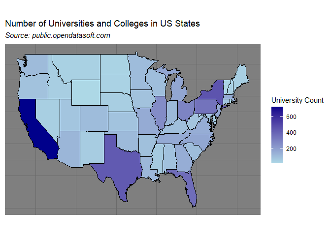
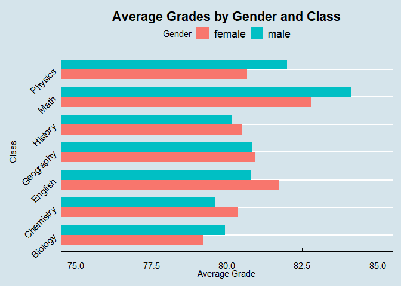
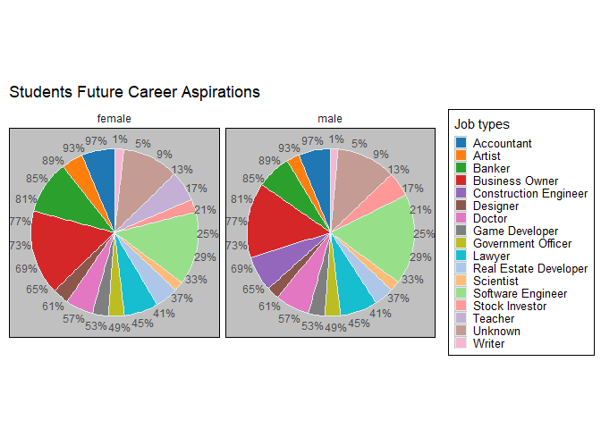
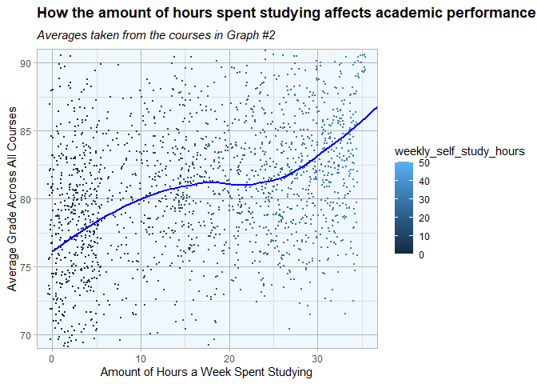
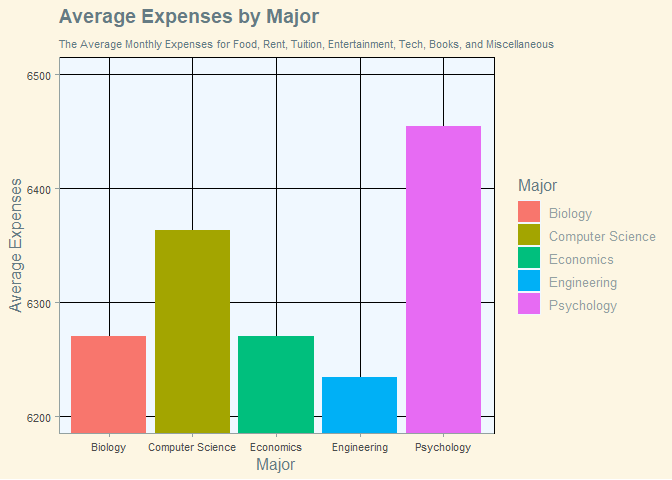

What is the Situation in American Universities?
================
James Mata (100816542)
2024-03-29

<h3>
<b>Introduction</b>
</h3>
<hr style="border-width: 10px">
<body>
The United States of America is currently 3rd world-wide in reference to
the number of universities it has. Because of this there are numerous
sets of data describing a variety of different quantities and qualities
surrounding American Academia. In this report we will be exploring some
of these characteristics to answer a few questions. First which US state
has the greatest number of universities? Next we will explore the
dichotomy between genders in University by attempting to understand how
grades differ per gender as well as majors. We will also try to
understand how effective studying is in getting good grades. Finally we
will explore the cost of University in America for a full ride all costs
included.
</body>
<h3>
<b>Data manipulation</b>
</h3>
<hr style="border-width: 10px">
<body>
For the data manipulation section for this report, we are going to first
start by importing our datasets. For this report we will be using
student.scores.csv and student_spending.(1).csv which reports numerous
facts about student performance in university and their spending habits
aswell. We will also use universities.csv which reports the locations of
universities in the USA
</body>
<body>
In this section we will also import all necessary libraries we will be
using in later sections.
</body>

``` r
#install.packages(c("tidyverse","ggplot2","ggthemes","scales","tidyr","RColorBrewer","maps"))

#Essential Libraries
library(tidyverse)
library(ggplot2)
library(ggthemes)
library(scales)
library(tidyr)
library(RColorBrewer)
library(maps)

#Data being analysed
scores <- read.csv("data/student-scores.csv")
spending <- read.csv("data/student_spending (1).csv")
university <- read.csv("data/universities.csv")
```

<body>
First we will remove irrelevant columns in each dataframe. Student
Scores contains personal values such as name, email, and ID which will
not be important for our data analysis, since from as far as I am aware
first name has no correlation with success (but maybe that will be a
future analysis). Student spending also contains an ID column which will
not be necessary and University has numerous university stats we will
not be using.
</body>

``` r
# Remove the column 'id' from the 'scores' dataframe
scores <- scores[, !(names(scores) %in% c("id"))]

# Remove the column 'first_name' from the 'scores' dataframe
scores <- scores[, !(names(scores) %in% c("first_name"))]

# Remove the column 'last_name' from the 'scores' dataframe
scores <- scores[, !(names(scores) %in% c("last_name"))]

# Remove the column 'email' from the 'scores' dataframe
scores <- scores[, !(names(scores) %in% c("email"))]

# Remove the column 'X' from the 'spending' dataframe
spending <- spending[, !(names(spending ) %in% c("X"))]

# Select only the columns 'NAME' and 'STATE' from the 'university' dataframe
universities <- university[, c("NAME","STATE")]
```

<h3>
<b>Analysis</b>
</h3>
<hr style="border-width: 10px">
<h5>
<b>Study \#1</b>
</h5>
<body>
In our first analysis we will be exploring the locations of American
universities to see which states offer the most amount of programs. We
will then color a map of the USA to reflect the quantity of programs in
that state.
</body>

<!-- -->

<h5>
<b>Results</b>
</h5>
<body>
From this graph it becomes very apparent that California is the leading
US state in the quantity of post secondary institutions with Texas,
Florida, and New York following behind. This is to be expected however
due to the approximate sizes of these states combined with their dense
populations. In contrast other States like Utah Montana, and the Dakotas
have relatively fewer Universities likely due to their smaller
populations
</body>
<h5>
<b>Study \#2</b>
</h5>
<body>
In our next analysis we will attempt to understand the differences in
male and female academic performance in each subject by plotting the
average score in each subject, by gender. To do this we will need to
separate rows by gender and take the averages of each rows columns value
plotting with a bar graph.
</body>

<!-- -->
<h5>
<b>Results</b>
</h5>
<body>
The results received points to the fact there is not a significant
difference between the academic performance of male and females in most
most courses. While men usually achieve higher math, biology, and
physics averages, women tend to score higher in history, geography,
english, and chemistry. This shows that both genders are relatively
equal academic wise as no gender holds a significantly higher average
overall.
</body>
<h5>
<b>Study \#3</b>
</h5>

In our third analysis we will try to understand which majors are most
often chosen by which gender. To do this we will need to count the
amount of each major exists and then plot the results in a pie chart.

<!-- -->
<h5>
<b>Results</b>
</h5>
<body>
This chart shows that both men and women have quite diverse career
interests with alot of interest shown in a wide spread of different
careers post university. There are some notes that can be taken about
the absence of construction engineers and teachers from the female and
male charts respectively. This shows the contrasting job desires between
the genders.
</body>
<h5>
<b>Study \#4</b>
</h5>
<body>
In our third analysis we will investigate the relationship between the
quantity of weekly study hours and academic success. Hopefully this will
demonstrate the positive correleation between studying and success. This
will be done by plotting a scatterplot of average grades over hours
studies.
</body>

<!-- -->
<h5>
<b>Results</b>
</h5>
<body>
The results received are quite unsurprising.As expected the amount of
hours spent studying positively correlates with academic success. An
interesting takeaway however comes from the fact this isn’t true for
everyone. The noisy data demonstrates that some individuals succeed with
little studying while others do poor with extensive studying. This
points to the idea that it isn’t truly the amount of hours of studying
you participate in that matters but rather the quality of studying
conducted.
</body>
<h5>
<b>Study \#5</b>
</h5>

In our forth analysis we will be attempting to discover a relationship
between student age and monthly expenses. We will do this by plotting a
scatter plot of student ages vs sum of all monthly expenses to see if
there is a pattern

<!-- -->
<h5>
<b>Results</b>
</h5>
<body>
This graph shows the interesting differences between average monthly
expenses for each major. It shows the psychology majors spend
significantly more per month then any other major. Interestingly
Engineering majors have the lowest expenses (probably on account of them
never having time for anything but homework and eating ramen) with
economics and biology majors a close second.
</body>
<h3>
References
</h3>
<hr style="border-width: 10px">
<h5>
Student Scores
</h5>

<link><https://www.kaggle.com/datasets/mexwell/student-scores/data>
</link>

<h5>
Student Spending Habits
</h5>

<link><https://www.kaggle.com/datasets/sumanthnimmagadda/student-spending-dataset>
</link>

<h5>
US Colleges and Universities
</h5>

<link><https://public.opendatasoft.com/explore/dataset/us-colleges-and-universities/export/>
</link>
